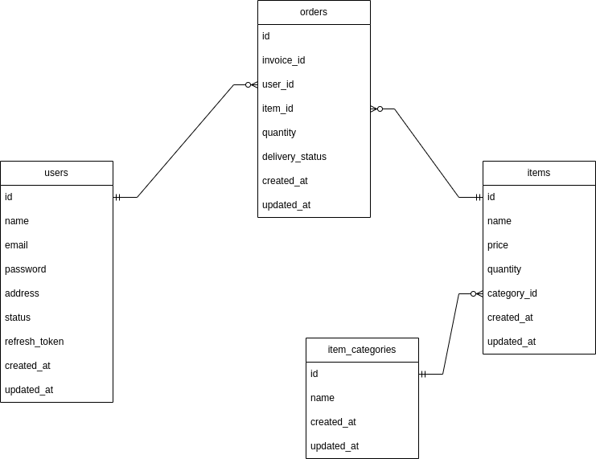

# go-order-items

Simple testing project with golang

### Requirement

- go 1.19
- mysql 5.7

### Setup guide for developers

- git clone
- copy .env.example to .env
- run go mod tidy
- run go mod vendor
- create database `order`
- copy and paste table schema from schema.sql file to create `order` database's tables
- go to appliction folder path and run **go run main.go**

### API Doc

- POST Sign_up of User (both)

  `request(json)` {
	"username",
	"email",
	"password",
	"address"
  }

  `response(json)` {
	"token" : "gsdgsdewcf",
	"refresh_token" : "tw523532523"
  }

- GET Sign_in of User (both)

  `request(json)` {
	"email",
	"password"
  }

  `response(json)` {
	"token" : "gsdgsdewcf",
	"refresh_token" : "tw523532523"
  }

- GET token refresh (both)

  `request(json)` {
	"email",
	"refresh_token"
  }

  `response(json)` {
	"token" : "sdgfewtwdsf",
	"refresh_token" : "sdgdsgssdg"
  }

- GET all categories ( both )

  `response(json)` [
	{
		"id": 1,
		"name": "i-phone",
		"CreatedAt": "2023-11-20T05:11:05Z",
		"UpdatedAt": "2023-11-20T05:11:05Z"
	},
	{
		"id": 2,
		"name": "air-pod",
		"CreatedAt": "2023-11-20T05:12:42Z",
		"UpdatedAt": "2023-11-20T05:12:42Z"
	}
  ]

- POST create category by admin ( admin )

  `request (route paramater)`
  {user_id}

  `request (json)` {
	"category_name" : "apple"
  }

  `response(json)` {
	"id": 5,
	"name": "i-pad2",
	"CreatedAt": "2023-11-20T10:21:11Z",
	"UpdatedAt": "2023-11-20T10:21:11Z"
  }

- DELETE remove category by admin ( admin )

  `request (json)` {
	"category_id" : "2"
  }

  `response (json)`
  Removing category process succeed!!!

- POST create item by admin ( admin )

  `request (route parameter)`
  {user_id}

  `request (json)` {
	"name" : "iphone 5s",
	"price" : 10000.00,
	"quantity" : 2,
	"category_id" : 1
  }

  `response (json)` {
	"id": 2,
	"name": "iphone 5s",
	"price": 10000,
	"quantity": 2,
	"category_id": 1,
	"CreatedAt": "2023-11-23T07:43:15.261Z",
	"UpdatedAt": "2023-11-23T07:43:15.261Z"
  }

- GET get items by category_id ( both )

  `request ( route parameter)`
   {category_id}

  `response (json)` {
	"id": 3,
	"name": "i-pad",
	"CreatedAt": "2023-11-20T05:14:01Z",
	"UpdatedAt": "2023-11-20T05:14:01Z",
	"Items": [
		{
			"id": 1,
			"name": "iphone 5s",
			"price": 5000,
			"quantity": 10,
			"category_id": 3,
			"CreatedAt": "2023-11-21T09:30:05Z",
			"UpdatedAt": "2023-11-21T09:30:05Z"
		},
		{
			"id": 2,
			"name": "iphone 6 plus",
			"price": 10000,
			"quantity": 10,
			"category_id": 3,
			"CreatedAt": "2023-11-23T07:43:15Z",
			"UpdatedAt": "2023-11-23T07:43:15Z"
		}
	]
  }

### Database Table Diagram

